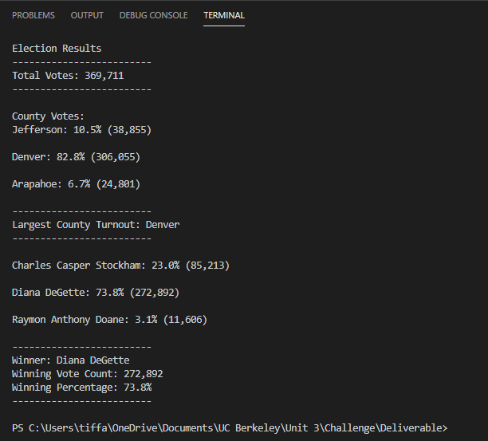
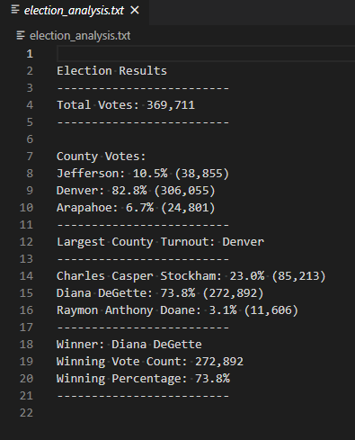

# Election_Analysis

## Project Overview
A Colorado Board of Elections employee has given me the following tasks to complete the election audit of a recent local congressional election.

### Tasks
1. Calculate the total number of votes cast.
2. Gather a complete list of counties where votes were cast.
3. Calculate the percentage of votes cast by county.
4. Calculate the total number of votes cast in each county.
5. Determine the largest county and county voter turnout.
6. Gather a complete list of candidates who received votes.
7. Calculate the percentage of votes each candidate won.
8. Calculate the total number of votes each candidate won.
9. Determine the winner of the election based on popular vote.

## Resources
 - Data Source: election_results.csv
 - Software: Python 3.7.6, Visual Studio Code Version 1.53
 
 ## Summary
 The analysis of the election data revealed the following:
 - There were 369,711 votes cast in the congressional election.
 - The counties included were: Jefferson, Denver, and Arapahoe.
 - The county results were: 
      - Jefferson: 10.5% (38,855)
      - Denver: 82.8% (306,055)
      - Arapahoe: 6.7% (24,801)
 - The county with the largest turnout was Denver.
 - The candidates were: Charles Casper Stockham, Diana DeGette, and Raymon Anthony Doane.
 - The candidate results were: 
      - Charles Casper Stockham: 23.0% (85,213)
      - Diana DeGette: 73.8% (272,892)
      - Raymon Anthony Doane: 3.1% (11,606)
 - The winner of the election was Diana DeGette with the Winning Vote Count of 272,892 and the Winning Percentage of 73.8%.
 ## Challenge Overview
 The challenge required me to pull the csv file into Visual Studio using the following code: "file_to_load = os.path.join("..", "election_results.csv")". Upon linking the data, I was able to run the analysis. Various code was used to calculate the county results, the candidates' results and to determine the respective winners.   The results were also written to a text file which resulted in the following: .
 ## Challenge Summary
 It was found that the county with the largest turnout was Denver, with 306,055 votes and the winner was Diana DeGette with 272,892 votes, which was 73.8% of the popular vote.
 ### Recommendations
 This script can be used, with some modifications, for any election. For example, if this was used to analyze the results of an election at the state level, one could dive deeper into the respective turn out results and votes from not only the counties, but also districts, and/or cities; additional code would be needed to account for those levels (pending the data is provided in the original data set).  Another example of how it can be used for any election is it could be used at the federal level; again, additional code would be needed to then analyze votes at state, county, district, city, and/or precinct level, if desired. It could even be used to analyze votes by political party.  To add the additional required code, one would need to initialize the new lists, dictionaries, empty strings, and variables.  Next, new scripts and decision statements should be made in addition to the repetition statements and scripts that calculate the desired anaylsis (ie percentage or count).  Finally, print statements should be added to include this information in the text file.
